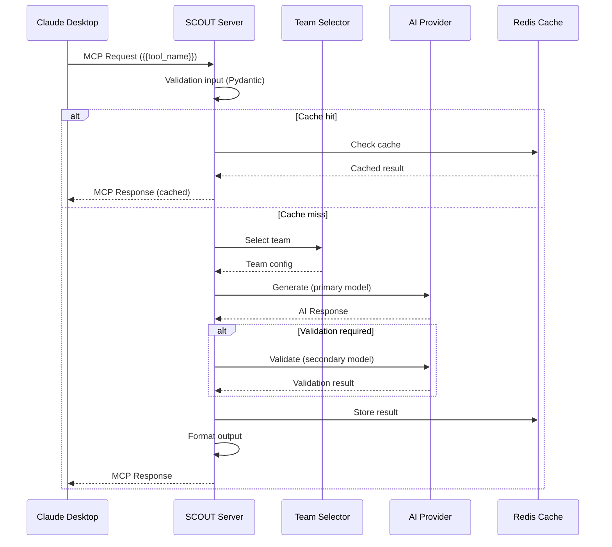

# Spécification : {{FEATURE_NAME}}

> Spécification technique conforme à la constitution SCOUT
> Date : {{DATE}}
> Version : {{VERSION}}
> Statut : {{DRAFT/REVIEW/APPROVED}}

---

## 1. Vue d'Ensemble

### Description
{{FEATURE_DESCRIPTION}}

### Motivation
**Problème actuel :**
{{CURRENT_PROBLEM}}

**Solution proposée :**
{{PROPOSED_SOLUTION}}

**Bénéfices attendus :**
- {{BENEFIT_1}}
- {{BENEFIT_2}}
- {{BENEFIT_3}}

### Alignement Stratégique
**Objectifs SCOUT alignés :**
- {{STRATEGIC_OBJECTIVE_1}}
- {{STRATEGIC_OBJECTIVE_2}}

**Principes constitutionnels appliqués :**
- [x] Architecture Contract-First
- [x] Architecture Modulaire
- [x] Tests Obligatoires
- [x] Documentation Auto-Générée
- [x] Gestion d'Erreur Robuste
- [x] Logging Structuré

---

## 2. Contexte et Cas d'Usage

### Utilisateurs Cibles
- **Primaire :** {{PRIMARY_USER}}
- **Secondaire :** {{SECONDARY_USER}}
- **Fréquence d'usage estimée :** {{FREQUENCY}}

### Cas d'Usage Principal

**CU-1 : {{USE_CASE_TITLE}}**

**Acteur :** {{ACTOR}}

**Préconditions :**
- {{PRECONDITION_1}}
- {{PRECONDITION_2}}

**Flux nominal :**
1. {{STEP_1}}
2. {{STEP_2}}
3. {{STEP_3}}
4. {{STEP_4}}

**Postconditions :**
- {{POSTCONDITION_1}}
- {{POSTCONDITION_2}}

**Flux alternatifs :**
- **Alt-1 : {{SCENARIO}}**
  1. {{ALT_STEP_1}}
  2. {{ALT_STEP_2}}

**Flux d'erreur :**
- **Err-1 : {{ERROR_SCENARIO}}**
  1. {{ERROR_STEP_1}}
  2. {{ERROR_STEP_2}}

### Exemples Concrets

**Exemple 1 : {{EXAMPLE_TITLE}}**
```
Contexte : {{CONTEXT}}
Action : {{ACTION}}
Résultat attendu : {{EXPECTED_RESULT}}
```

**Exemple 2 : {{EXAMPLE_TITLE}}**
```
Contexte : {{CONTEXT}}
Action : {{ACTION}}
Résultat attendu : {{EXPECTED_RESULT}}
```

---

## 3. Exigences Fonctionnelles

### RF-1 : {{REQUIREMENT_TITLE}}
**Priorité :** {{CRITICAL/HIGH/MEDIUM/LOW}}

**Description :**
{{DETAILED_REQUIREMENT_DESCRIPTION}}

**Critères d'acceptation :**
- [ ] {{ACCEPTANCE_CRITERION_1}}
- [ ] {{ACCEPTANCE_CRITERION_2}}
- [ ] {{ACCEPTANCE_CRITERION_3}}

**Validation :**
```python
# Test fonctionnel
def test_rf1_{{requirement_id}}():
    # Given
    {{GIVEN_STATE}}
    # When
    {{WHEN_ACTION}}
    # Then
    {{THEN_ASSERTION}}
```

---

### RF-2 : {{REQUIREMENT_TITLE}}
**Priorité :** {{CRITICAL/HIGH/MEDIUM/LOW}}

**Description :**
{{DETAILED_REQUIREMENT_DESCRIPTION}}

**Critères d'acceptation :**
- [ ] {{ACCEPTANCE_CRITERION_1}}
- [ ] {{ACCEPTANCE_CRITERION_2}}

---

## 4. Exigences Non-Fonctionnelles

### RNF-1 : Performance
**Cible :** {{TARGET_PERFORMANCE}}

**Métriques :**
- Latence P50 : < {{VALUE}}ms
- Latence P95 : < {{VALUE}}ms
- Latence P99 : < {{VALUE}}ms
- Throughput : > {{VALUE}} req/s

**Tests de performance :**
```python
@pytest.mark.benchmark
def test_performance_{{feature}}():
    # Mesure latence P95
    results = benchmark({{function}}, {{params}})
    assert results.stats.p95 < {{TARGET_MS}}
```

---

### RNF-2 : Fiabilité
**Cible :** {{TARGET_RELIABILITY}}

**Métriques :**
- Taux de succès : > {{PERCENT}}%
- MTBF (Mean Time Between Failures) : > {{VALUE}} heures
- MTTR (Mean Time To Recovery) : < {{VALUE}} minutes

**Stratégies de résilience :**
- Retry automatique : {{MAX_RETRIES}} tentatives
- Fallback : {{FALLBACK_STRATEGY}}
- Circuit breaker : Ouverture après {{THRESHOLD}} échecs

---

### RNF-3 : Coûts
**Budget :** ${{BUDGET_USD}}/jour

**Décomposition :**
| Composant | Coût unitaire | Volume | Coût/jour |
|-----------|---------------|--------|-----------|
| {{COMPONENT_1}} | ${{UNIT_COST}} | {{VOLUME}} | ${{DAILY_COST}} |
| {{COMPONENT_2}} | ${{UNIT_COST}} | {{VOLUME}} | ${{DAILY_COST}} |
| **Total** | | | **${{TOTAL_COST}}** |

**Optimisations :**
- {{OPTIMIZATION_1}}
- {{OPTIMIZATION_2}}

---

### RNF-4 : Sécurité
**Niveau de sécurité requis :** {{STANDARD/SENSITIVE/CRITICAL}}

**Exigences :**
- [ ] Validation stricte des entrées (schéma JSON)
- [ ] Sanitization des inputs avant envoi aux providers
- [ ] Pas d'exécution de code arbitraire
- [ ] Logging sécurisé (pas de secrets)
- [ ] Rate limiting pour prévenir abus

**Validation sécurité :**
```python
def test_security_input_validation():
    # Test injection SQL
    malicious_input = "'; DROP TABLE users; --"
    with pytest.raises(ValidationError):
        validate_input(malicious_input)
```

---

### RNF-5 : Maintenabilité
**Exigences :**
- Couverture de tests : ≥ 80%
- Complexité cyclomatique : ≤ 10 par fonction
- Documentation : Docstrings complètes
- Logs structurés : JSON format

---

## 5. Spécification Technique

### 5.1 Contrat MCP (Contract-First)

**Nom du tool :** `{{TOOL_NAME}}`

**Description :** {{TOOL_DESCRIPTION}}

**Schéma JSON :**
```json
{
  "name": "{{TOOL_NAME}}",
  "description": "{{TOOL_DESCRIPTION}}",
  "inputSchema": {
    "type": "object",
    "properties": {
      "{{param_1}}": {
        "type": "{{TYPE}}",
        "description": "{{DESCRIPTION}}",
        "{{CONSTRAINT_KEY}}": {{CONSTRAINT_VALUE}}
      },
      "{{param_2}}": {
        "type": "{{TYPE}}",
        "description": "{{DESCRIPTION}}",
        "enum": [{{ENUM_VALUES}}]
      },
      "team": {
        "type": "string",
        "description": "Override équipe AI (optionnel)",
        "enum": ["scout", "architect", "expert", "thinker"]
      }
    },
    "required": ["{{REQUIRED_PARAM_1}}", "{{REQUIRED_PARAM_2}}"]
  },
  "outputSchema": {
    "type": "object",
    "properties": {
      "{{result_key}}": {
        "type": "{{TYPE}}",
        "description": "{{DESCRIPTION}}"
      },
      "metadata": {
        "type": "object",
        "properties": {
          "model_used": {"type": "string"},
          "tokens_used": {
            "type": "object",
            "properties": {
              "input": {"type": "integer"},
              "output": {"type": "integer"}
            }
          },
          "cost_usd": {"type": "number"},
          "duration_ms": {"type": "integer"}
        }
      }
    }
  }
}
```

### 5.2 Validation Pydantic

```python
from pydantic import BaseModel, Field, validator
from typing import Optional, Literal

class {{ToolName}}Input(BaseModel):
    """Input du tool {{TOOL_NAME}}"""

    {{param_1}}: {{Type}} = Field(
        ...,
        description="{{DESCRIPTION}}",
        {{CONSTRAINT_KEY}}={{CONSTRAINT_VALUE}}
    )

    {{param_2}}: Literal[{{ENUM_VALUES}}] = Field(
        default="{{DEFAULT_VALUE}}",
        description="{{DESCRIPTION}}"
    )

    team: Optional[Literal["scout", "architect", "expert", "thinker"]] = Field(
        default=None,
        description="Override équipe AI"
    )

    @validator('{{param_1}}')
    def validate_{{param_1}}(cls, v):
        """Validation custom de {{param_1}}"""
        if {{CONDITION}}:
            raise ValueError("{{ERROR_MESSAGE}}")
        return v

    class Config:
        schema_extra = {
            "example": {
                "{{param_1}}": "{{EXAMPLE_VALUE}}",
                "{{param_2}}": "{{EXAMPLE_VALUE}}"
            }
        }


class {{ToolName}}Output(BaseModel):
    """Output du tool {{TOOL_NAME}}"""

    {{result_key}}: {{Type}} = Field(
        ...,
        description="{{DESCRIPTION}}"
    )

    metadata: dict = Field(
        default_factory=dict,
        description="Métadonnées d'exécution"
    )
```

### 5.3 Structure du Handler

```python
# src/scout/tools/{{tool_name}}.py
from scout.tools.registry import registry
from scout.core.team_selector import TeamSelector
from scout.providers.factory import ProviderFactory
from scout.exceptions import {{ToolName}}Error
import structlog

logger = structlog.get_logger()

@registry.register(
    name="{{tool_name}}",
    description="{{TOOL_DESCRIPTION}}",
    schema={{SCHEMA_REFERENCE}},
    default_team="{{DEFAULT_TEAM}}"
)
async def {{tool_name}}_handler(
    {{param_1}}: {{Type}},
    {{param_2}}: {{Type}} = "{{DEFAULT_VALUE}}",
    team: Optional[str] = None,
    **kwargs
) -> dict:
    """
    {{HANDLER_DESCRIPTION}}

    Args:
        {{param_1}}: {{DESCRIPTION}}
        {{param_2}}: {{DESCRIPTION}}
        team: Override équipe AI (optionnel)

    Returns:
        dict: Résultat avec structure définie dans outputSchema

    Raises:
        {{ToolName}}Error: {{ERROR_DESCRIPTION}}
        ValidationError: Si input invalide
    """

    request_id = kwargs.get("request_id", "unknown")

    logger.info(
        "{{tool_name}}_execution_started",
        request_id=request_id,
        tool_name="{{tool_name}}",
        team=team,
        param_1_size=len({{param_1}})
    )

    try:
        # 1. Validation input (déjà fait par Pydantic, mais double-check si nécessaire)
        _validate_input({{param_1}}, {{param_2}})

        # 2. Sélection équipe AI
        team_selector = kwargs.get("team_selector")
        team_config = team_selector.select_team(
            tool_name="{{tool_name}}",
            user_override=team
        )

        logger.info(
            "team_selected",
            request_id=request_id,
            team_name=team_config.name,
            primary_model=team_config.primary["model"]
        )

        # 3. Obtenir provider primaire
        provider_factory = kwargs.get("provider_factory")
        primary_provider = provider_factory.get_provider(
            team_config.primary["provider"]
        )

        # 4. Construire prompt
        prompt = _build_prompt({{param_1}}, {{param_2}})

        # 5. Exécution primaire
        start_time = time.time()
        primary_response = await primary_provider.generate(
            prompt=prompt,
            model=team_config.primary["model"],
            temperature={{TEMPERATURE}},
            max_tokens={{MAX_TOKENS}}
        )
        duration_ms = int((time.time() - start_time) * 1000)

        result = primary_response.content

        # 6. Validation secondaire (si configurée)
        if team_config.validators:
            result = await _validate_with_secondary(
                result,
                team_config,
                provider_factory,
                request_id
            )

        # 7. Post-traitement
        final_result = _format_output(result)

        logger.info(
            "{{tool_name}}_execution_completed",
            request_id=request_id,
            duration_ms=duration_ms,
            tokens_used=primary_response.tokens_used,
            cost_usd=primary_response.cost_usd
        )

        return {
            "{{result_key}}": final_result,
            "metadata": {
                "model_used": primary_response.model,
                "tokens_used": primary_response.tokens_used,
                "cost_usd": primary_response.cost_usd,
                "duration_ms": duration_ms
            }
        }

    except Exception as e:
        logger.error(
            "{{tool_name}}_execution_failed",
            request_id=request_id,
            error_type=type(e).__name__,
            error_message=str(e),
            exc_info=True
        )
        raise {{ToolName}}Error(
            message=f"Échec exécution {{tool_name}}: {str(e)}",
            code="TOOL_EXECUTION_FAILURE",
            details={"request_id": request_id}
        ) from e


def _validate_input({{param_1}}, {{param_2}}):
    """Validation supplémentaire si nécessaire"""
    if {{CONDITION}}:
        raise ValueError("{{ERROR_MESSAGE}}")


def _build_prompt({{param_1}}, {{param_2}}) -> str:
    """Construit le prompt pour le modèle AI"""
    return f"""
    {{PROMPT_TEMPLATE}}
    """


async def _validate_with_secondary(
    result: str,
    team_config: TeamConfig,
    provider_factory: ProviderFactory,
    request_id: str
) -> str:
    """Validation par modèle secondaire"""
    validator_config = team_config.validators[0]

    # TODO: Implémenter logique de validation
    # ...

    return result


def _format_output(result: str) -> dict:
    """Formate le résultat final"""
    # TODO: Parser et structurer le résultat
    return {"formatted": result}
```

### 5.4 Gestion d'Erreur

**Hiérarchie d'exceptions :**
```python
# src/scout/exceptions.py
class {{ToolName}}Error(ScoutError):
    """Erreur générique pour {{TOOL_NAME}}"""
    pass

class {{ToolName}}ValidationError({{ToolName}}Error):
    """Erreur de validation d'input"""
    pass

class {{ToolName}}ProviderError({{ToolName}}Error):
    """Erreur liée au provider AI"""
    pass

class {{ToolName}}TimeoutError({{ToolName}}Error):
    """Timeout lors de l'exécution"""
    pass
```

**Stratégies de récupération :**

| Erreur | Action | Retry | Fallback |
|--------|--------|-------|----------|
| `ValidationError` | Log + retour erreur immédiat | Non | N/A |
| `ProviderError` (429 rate limit) | Attente + retry | Oui (3x) | Équipe alternative |
| `ProviderError` (500 server) | Log + retry | Oui (2x) | Fail fast |
| `TimeoutError` | Log + abandon | Non | Retour partiel si disponible |

---

## 6. Architecture et Intégrations

### 6.1 Diagramme de Séquence



### 6.2 Dépendances

**Dépendances internes (modules SCOUT) :**
- `scout.core.orchestrator` : Routing et orchestration
- `scout.core.team_selector` : Sélection équipe AI
- `scout.providers.factory` : Factory de providers
- `scout.utils.cache` : Caching Redis
- `scout.utils.rate_limiter` : Rate limiting

**Dépendances externes (packages Python) :**
```toml
[tool.poetry.dependencies]
python = "^3.11"
fastmcp = "^{{VERSION}}"
pydantic = "^{{VERSION}}"
structlog = "^{{VERSION}}"
redis = "^{{VERSION}}"
httpx = "^{{VERSION}}"
{{ADDITIONAL_DEPENDENCIES}}
```

### 6.3 Intégrations Externes

**Provider AI utilisés :**
- {{PROVIDER_1}} : Modèle {{MODEL_1}} (équipe {{TEAM_1}})
- {{PROVIDER_2}} : Modèle {{MODEL_2}} (équipe {{TEAM_2}})

**Services tiers :**
- Redis : Cache et state management
- {{EXTERNAL_SERVICE}} : {{PURPOSE}}

---

## 7. Données et Modèles

### 7.1 Modèles de Données

**Input Model :**
```python
{{INPUT_MODEL_CODE}}
```

**Output Model :**
```python
{{OUTPUT_MODEL_CODE}}
```

**Internal State (si applicable) :**
```python
class {{ToolName}}State(BaseModel):
    """État interne du tool (stocké en Redis)"""
    {{state_field_1}}: {{Type}}
    {{state_field_2}}: {{Type}}
    created_at: datetime
    ttl_seconds: int = 3600
```

### 7.2 Persistence

**Stratégie de cache :**
- **Clé Redis :** `cache:{{tool_name}}:{{HASH_INPUT}}`
- **TTL :** {{TTL_SECONDS}} secondes
- **Invalidation :** TTL expiration ou manuelle si nécessaire

**Exemple :**
```python
cache_key = f"cache:{{tool_name}}:{hashlib.sha256(input_json.encode()).hexdigest()}"
await redis.setex(cache_key, {{TTL_SECONDS}}, json.dumps(result))
```

---

## 8. Tests et Validation

### 8.1 Stratégie de Test

**Pyramide de tests :**
- **Tests unitaires (70%)** : Handlers, validators, formatters
- **Tests intégration (20%)** : Interaction avec providers (mockés)
- **Tests end-to-end (10%)** : Via MCP avec providers réels (staging)

### 8.2 Plan de Tests

**Test Suite :** `tests/test_{{tool_name}}.py`

```python
import pytest
from scout.tools.{{tool_name}} import {{tool_name}}_handler
from scout.exceptions import {{ToolName}}Error

@pytest.mark.asyncio
async def test_{{tool_name}}_valid_input(mock_dependencies):
    """Test cas nominal avec input valide"""
    result = await {{tool_name}}_handler(
        {{param_1}}="{{VALID_VALUE}}",
        {{param_2}}="{{VALID_VALUE}}",
        **mock_dependencies
    )
    assert "{{result_key}}" in result
    assert result["metadata"]["cost_usd"] > 0


@pytest.mark.asyncio
async def test_{{tool_name}}_invalid_input():
    """Test validation input invalide"""
    with pytest.raises(ValidationError):
        await {{tool_name}}_handler(
            {{param_1}}="{{INVALID_VALUE}}"
        )


@pytest.mark.asyncio
async def test_{{tool_name}}_provider_failure(mock_failing_provider):
    """Test gestion d'erreur provider"""
    with pytest.raises({{ToolName}}ProviderError):
        await {{tool_name}}_handler(
            {{param_1}}="{{VALID_VALUE}}",
            provider_factory=mock_failing_provider
        )


@pytest.mark.asyncio
async def test_{{tool_name}}_with_cache(mock_redis):
    """Test utilisation du cache"""
    # First call: miss cache
    result1 = await {{tool_name}}_handler(...)

    # Second call: hit cache
    result2 = await {{tool_name}}_handler(...)

    assert result1 == result2
    mock_redis.get.assert_called()


@pytest.mark.asyncio
async def test_{{tool_name}}_team_override(mock_dependencies):
    """Test override équipe"""
    result = await {{tool_name}}_handler(
        {{param_1}}="{{VALID_VALUE}}",
        team="expert",
        **mock_dependencies
    )
    # Vérifie que le modèle expert a été utilisé
    assert "opus" in result["metadata"]["model_used"]


@pytest.mark.benchmark
def test_{{tool_name}}_performance(benchmark):
    """Test de performance (P95 < {{TARGET}}ms)"""
    result = benchmark(lambda: asyncio.run({{tool_name}}_handler(...)))
    assert result.stats.p95 < {{TARGET_MS}}
```

### 8.3 Critères d'Acceptation Tests

- [ ] Tous les tests passent (100%)
- [ ] Couverture ≥ 80% sur le nouveau code
- [ ] Pas de régression sur tests existants
- [ ] Tests de performance validés (P95 < {{TARGET}})
- [ ] Tests de sécurité passent (input validation)

---

## 9. Sécurité

### 9.1 Analyse de Menaces

| Menace | Impact | Probabilité | Mitigation |
|--------|---------|-------------|-----------|
| Injection malicieuse dans input | High | Medium | Validation stricte Pydantic + sanitization |
| Exposition de secrets dans logs | High | Low | Logging sécurisé sans secrets |
| Rate limit abuse | Medium | Medium | Rate limiting par user + global |
| Exfiltration de données | High | Low | Pas de stockage données sensibles |

### 9.2 Mesures de Sécurité

**Input Validation :**
```python
# Validation stricte des types
{{param}}: constr(max_length=100000, regex="^[a-zA-Z0-9\s\-_]+$")
```

**Sanitization :**
```python
def sanitize_input(value: str) -> str:
    """Nettoie input avant envoi au provider"""
    # Supprimer caractères dangereux
    value = re.sub(r'[<>"\']', '', value)
    # Limiter taille
    return value[:100000]
```

**Logging Sécurisé :**
```python
# ❌ INCORRECT
logger.info(f"API Key: {api_key}")

# ✅ CORRECT
logger.info("Provider authenticated", provider="gemini")
```

---

## 10. Documentation

### 10.1 Documentation Utilisateur

**Emplacement :** `docs/usage/{{tool_name}}.md`

**Contenu requis :**
- Description du tool et cas d'usage
- Exemples concrets (3-5 cas)
- Paramètres et leurs effets
- Conseils d'utilisation (team selection, optimisation coûts)
- FAQ et troubleshooting

### 10.2 Documentation Développeur

**Emplacement :** `docs/api/{{tool_name}}.md`

**Contenu requis (auto-généré) :**
- Schéma JSON MCP
- Signature Python du handler
- Modèles Pydantic (input/output)
- Exceptions possibles
- Exemples d'intégration

### 10.3 Exemples

**Exemple 1 : Cas nominal**
```python
from scout.tools.{{tool_name}} import {{tool_name}}_handler

result = await {{tool_name}}_handler(
    {{param_1}}="{{EXAMPLE_VALUE}}",
    {{param_2}}="{{EXAMPLE_VALUE}}"
)

print(result["{{result_key}}"])
# Output: {{EXPECTED_OUTPUT}}
```

**Exemple 2 : Override équipe**
```python
# Utiliser équipe expert pour décision critique
result = await {{tool_name}}_handler(
    {{param_1}}="{{EXAMPLE_VALUE}}",
    team="expert"
)
```

---

## 11. Métriques et KPIs

### Métriques Techniques

| Métrique | Cible | Mesure |
|----------|-------|---------|
| Latence P50 | < {{TARGET}}ms | {{ACTUAL}}ms |
| Latence P95 | < {{TARGET}}ms | {{ACTUAL}}ms |
| Latence P99 | < {{TARGET}}ms | {{ACTUAL}}ms |
| Taux succès | > {{TARGET}}% | {{ACTUAL}}% |
| Taux erreur | < {{TARGET}}% | {{ACTUAL}}% |

### Métriques Business

| Métrique | Cible | Mesure |
|----------|-------|---------|
| Adoption (% utilisateurs actifs) | > {{TARGET}}% | {{ACTUAL}}% |
| Fréquence usage (fois/jour/user) | > {{TARGET}} | {{ACTUAL}} |
| Satisfaction utilisateur | > {{TARGET}}/5 | {{ACTUAL}}/5 |
| Coût moyen par requête | < ${{TARGET}} | ${{ACTUAL}} |

### Dashboards

**Métriques temps réel :**
- Grafana dashboard : `{{DASHBOARD_URL}}`
- Logs structurés : `{{LOG_AGGREGATOR_URL}}`
- Alertes : `{{ALERT_MANAGER_URL}}`

---

## 12. Roadmap et Évolutions Futures

### Version {{CURRENT_VERSION}} ({{DATE}})
**Scope actuel :** {{CURRENT_SCOPE}}

### Version {{NEXT_VERSION}} ({{PLANNED_DATE}})
**Évolutions planifiées :**
- {{FUTURE_FEATURE_1}}
- {{FUTURE_FEATURE_2}}
- {{FUTURE_FEATURE_3}}

### Backlog

**Nice-to-have (non priorisé) :**
- {{BACKLOG_ITEM_1}}
- {{BACKLOG_ITEM_2}}

---

## 13. Références

### Documents Liés
- Constitution SCOUT : `.speckit/constitution.md`
- PRD complet : `PRD.md`
- Plan d'implémentation : `.speckit/plans/{{feature_name}}-plan.md`
- Architecture globale : `docs/architecture.md`

### Standards Externes
- MCP Protocol : https://modelcontextprotocol.io
- Pydantic Validation : https://docs.pydantic.dev
- OpenTelemetry : https://opentelemetry.io

### Ressources Internes
- Tool Registry Pattern : `src/scout/tools/registry.py`
- Provider Abstraction : `src/scout/providers/base.py`
- Team Selector : `src/scout/core/team_selector.py`

---

## 14. Changelog

### Version {{VERSION}} ({{DATE}})

**Ajouté :**
- {{ADDED_1}}

**Modifié :**
- {{MODIFIED_1}}

**Déprécié :**
- {{DEPRECATED_1}}

**Supprimé :**
- {{REMOVED_1}}

**Corrigé :**
- {{FIXED_1}}

---

## 15. Approbation

### Revue Technique
- [ ] Architecture validée par {{TECH_LEAD}}
- [ ] Sécurité validée par {{SECURITY_REVIEWER}}
- [ ] Performance validée par {{PERFORMANCE_REVIEWER}}

### Revue Fonctionnelle
- [ ] Cas d'usage validés par {{PRODUCT_OWNER}}
- [ ] UX validée par {{UX_REVIEWER}}

### Signature
**Approuvé par :** {{APPROVER_NAME}}
**Date :** {{APPROVAL_DATE}}
**Version approuvée :** {{APPROVED_VERSION}}

---

**Prochaine revue :** {{NEXT_REVIEW_DATE}}
